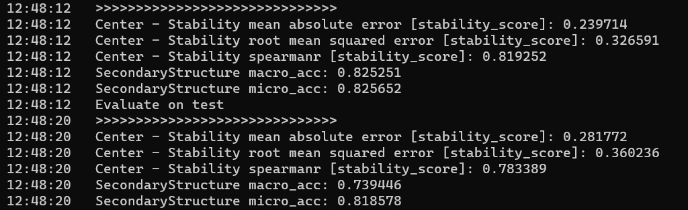

# hybrid-protein-predictor

本仓库用于存放AI for Science比赛"CG2302-基于机器学习的蛋白质适应度预测任务"赛题解决方案。我们设计了一个包含局部特征提取和全局特征学习功能的混合模型，其中局部特征提取使用卷积神经网络CNN实现，蛋白质序列的全局特征学习由预训练模型ProtBert实现。

我们的代码基于PEER_Benchmark框架运行，关于PEER_Benchmark框架的详细信息请[点击此处]([点击此处](https://github.com/DeepGraphLearning/PEER_Benchmark/tree/main))。

## 安装

运行代码前需要配置PEER_Benchmark的相关环境。安装要求使用Python 3.7/3.8且PyTorch版本不低于1.8.0。

```bash
conda create -n protein python=3.7
conda activate protein

conda install pytorch==1.8.0 cudatoolkit=10.2 -c pytorch
conda install scikit-learn pandas decorator ipython networkx tqdm matplotlib -y
conda install pytorch-scatter pytorch-cluster -c pyg -c conda-forge
pip install fair-esm transformers easydict pyyaml lmdb

python -m pip install git+https://github.com/DeepGraphLearning/torchdrug/
```

## 运行

### 单GPU运行

运行前需要对模型结构、任务类别、训练参数等参数进行设置，完成设置后执行以下命令：

```bash
cd PEER_Benchmark

# 单任务学习
python script/run_single.py -c config/single_task/$model/$yaml_config --seed 0

# 多任务学习
python script/run_multi.py -c config/multi_task/$model/$yaml_config --seed 0
```

### 多GPU运行

多GPU运行首先需要在yaml配置文件中指定运行GPU的编号（`gpus = [0,1,2,3]`表示使用4块GPU进行数据并行训练，注意此处的GPU编号数量需要与命令中`--nproc_per_node`指定的GPU数量相同），然后执行以下命令：

```bash
cd PEER_Benchmark

# 单任务学习
python -m torch.distributed.launch --nproc_per_node=4 script/run_single.py -c config/single_task/$model/$yaml_config --seed 0

# 多任务学习
python -m torch.distributed.launch --nproc_per_node=4 script/run_multi.py -c config/multi_task/$model/$yaml_config --seed 0
```

## 实验结果复现

我们的最佳模型表现由混合模型在fluorescence_ss和stability_ss两个多任务学习环境下测试得到，训练配置放置在`./PEER_Benchmark/config/multi_task/Hybrid_best`中。模型参数在本仓库的`model_params`分支，复现前需要先将模型参数下载至本地（大小约为10GB），并配置文件中的`checkpoint`属性修改为`./best_params`中模型参数的绝对路径，再执行以下命令：

```bash
cd PEER_Benchmark

# 荧光性预测任务
python -m torch.distributed.launch --nproc_per_node=2 script/run_multi_test.py -c config/multi_task/Hybrid_best/fluorescence_ss.yaml --seed 0

# 稳定性预测任务
python -m torch.distributed.launch --nproc_per_node=2 script/run_multi_test.py -c config/multi_task/Hybrid_best/stability_ss.yaml --seed 0
```

预测结果如下：

<div align="center">
蛋白质荧光性预测结果

</div>

<div align="center">
蛋白质稳定性预测结果

</div>
